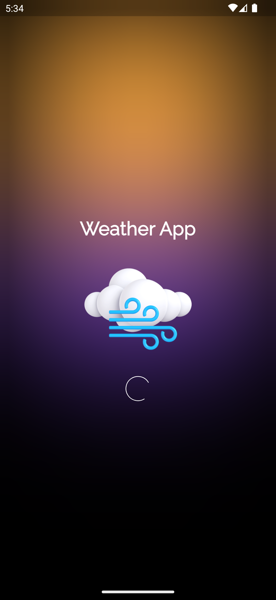
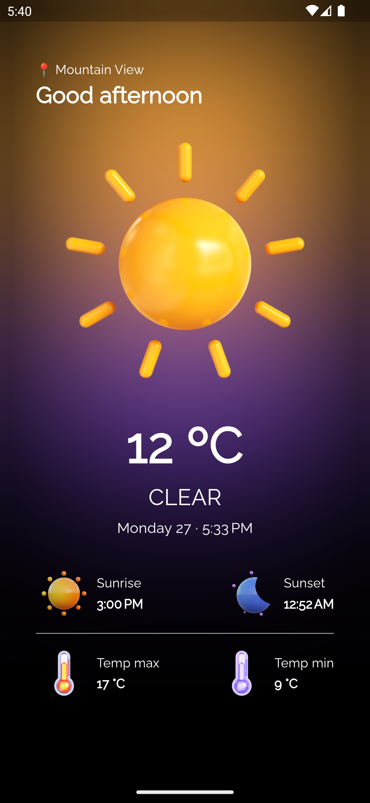

# Weather App — Clean Architecture and BLoC Pattern

  <table>
    <thead>
        <tr>
            <th align="center">
              <small>Loading state</small>
            </th>
            <th align="center">
              <small>Home Screen</small>
            </th>
        </tr>
    </thead>
    <tbody>
        <tr>
            <td></td>
            <td><a href="02"></td>
        </tr>
    </tbody>
  </table>

## Estrutura de pastas

- [`lib`](./lib) — principais camadas e arquivos do app.

  - [`core`](./lib/core) — arquivos `core` ou comuns da aplicação, exceções, componentes genéricos e utilitários disponibilizados para todo o app.
    - [`errors`](./lib/core/errors/) — tratamento de exceções.
    - [`usecases`](./lib/core/usecases/) — contratos de casos de uso.
    - [`utils`](./lib/core/utils/) — utilitários do app.
    - [`view`](./lib/core/view/) — tema padrão e widgets utilizadas por mais de uma feature por exemplo.
  - [`modules`](./lib/modules/) — módulos ou `features` da aplicação como `auth`, `home` ou `splash` por exemplo.

    - [`weather`](./lib/modules/weather/)

      - [`core`](./lib/modules/weather/core/) — camada de domínio da `feature`.
        - [`entities`](./lib/modules/weather/core/entities/) — responsável por estruturar os `modelos de dados` principais do app.
        - [`repositories`](./lib/modules/weather/core/repositories/) — responsável por definir contratos entre a camada `domínio` e a camada de `data` — ajudam a aplicar o princípio `DIP` do `SOLID`.
        - [`usecases`](./lib/modules/weather/core/usecases/) — representam a lógica de negócio do app com foco em uma única responsabilidade (dependem da utilização dos `repositories` e chamam seus métodos) — aplicam o princípio `SRP` do `SOLID`.
      - [`data`](./lib/modules/weather/data) — camada responsável por buscar dados externos seguindo os contratos da camada de domínio.

        - [`datasources`](./lib/modules/weather/data/datasources/) — implementam as interfaces definidas para os `repositories` na camada de domínio e são responsáveis por prover dados de fontes externas como `API's` ou `databases`, onde podem depender de algum `adapter` para isso — promovem modularidade e ajudam a aplicar o princípio `DIP` do `SOLID`.
        - [`models`](./lib/modules/weather/data/models/) — são subclasses das entidades que tratam implementam os `JSON Serialization methods`, transformando dados entre entidades de data sources — ajudam a aplicar o princípio `OCP` do `SOLID`.
        - [`repositories`](./lib/modules/weather/data/repositories/) — implementam os contratos ou interfaces definidas na camada de domínio, tratando erros e interagindo com os `datasources` para recuperar dados.

      - [`view`](./lib/modules/weather/view) — responsável por apresentar e interpretar informações e ações do usuário
        - [`bloc`](./lib/modules/weather/view/bloc/) — `BLoc Pattern`, gerencia os estados das telas e suas regras de negócio dependendo dos `usecases` para executar operações lógicas.
        - [`screens`](./lib/modules/weather/view/screens/) — tela(s) necessárias para a feature que escutam eventos do `BLoC` e reagem a suas alterações atualizando a `UI` de acordo.
        - [`widgets`](./lib/modules/weather/view/widgets/) — componentes reutilizáveis entre as telas.

- [`app_module.dart`](./lib/app_module.dart) — responsável pela injeção de dependências através do `Provider` para disponibilizar dependências a diferentes camadas do app — ajuda a gerenciar as dependências e permite um `easy swapping` de implementações.
- [`test`](./test) — camada de testes seguindo a mesma estrutura da [`lib`](./lib).

### Legenda

- `SOLID`
  - `SRP` — Single Responsibility Principle (Princípio da responsabilidade única);
  - `OCP` — Open-Closed Principle (Princípio Aberto-Fechado);
  - `LSP` — Liskov Substitution Principle (Princípio da substituição de Liskov);
  - `ISP` — Interface Segregation Principle (Princípio da Segregação da Interface);
  - `DIP` — Dependency Inversion Principle (Princípio da inversão da dependência);
- `BLoC Pattern`
  - O Bloc Pattern é um padrão de design de software que ajuda a separar a lógica de negócios da apresentação (view) em aplicativos móveis. Ele permite que os desenvolvedores gerenciem eficientemente e convenientemente o estado em seus aplicativos sem um acoplamento rígido entre a apresentação e a lógica. Ele também visa a reutilização da mesma lógica em vários widgets.
